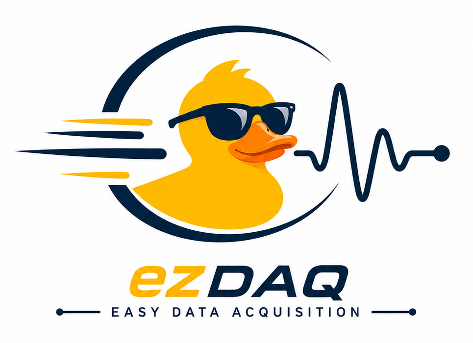

<p align="center">
  
</p>

# ezDAQ - Easy Data Acquisition

*[English version](README.md)*

Windows-Desktopanwendung zur Datenerfassung und Analyse von Messdaten mit
NI-cDAQ-Systemen (NI 9215, NI 9234, NI 9210, NI 9213, NI 9235).

## Funktionsumfang (aktueller Stand)

**Hardware & Erfassung**
- Geräteerkennung und -konfiguration für NI 9215 (±10 V Spannung),
  NI 9234 (Spannung oder IEPE-Beschleunigung/Mikrofon), NI 9210 (4-Kanal
  Thermoelement), NI 9213 (16-Kanal Thermoelement, J/K/T/E/N/R/S/B) und
  NI 9235 (8-Kanal 120-Ω-Viertelbrücke Dehnungsmessstreifen)
- Module, die der Treiber meldet, diese Anwendung aber (noch) nicht
  kennt, werden bei jeder Geräteaktualisierung per Warndialog gemeldet -
  ihre Kanäle lassen sich in der Kanalkonfiguration nicht auswählen
- Synchronisierte Erfassung über mehrere Module hinweg (gemeinsamer
  nidaqmx-Task), inklusive automatischer Aufteilung in unabhängige,
  intern synchronisierte Tasks, wenn kombinierte Module sich keinen
  gemeinsamen Sample-Takt teilen können (z. B. NI 9210s feste 14 S/s,
  oder sich für die Zielrate nicht überschneidende NI 9234-/NI 9235-
  Abtastraster)
- Live-Datenerfassung in einem eigenen DAQ-Thread über einen
  thread-sicheren Ring Buffer (ausgelegt bis 100 kHz)
- Speicherung während der Messung als Parquet (bevorzugt) oder CSV,
  inklusive `metadata`-JSON (Startzeit, Abtastrate, Hardware, Kanäle,
  Skalierungen, Einheiten)
- Kanalparameter je nach Signaltyp (Skalierung, Offset, Sensitivität,
  Thermoelement-Typ, Gage-Faktor/Brückentyp bei Dehnung) über einen
  eigenen Einstellungsdialog pro Kanal, inklusive 2-Punkt-Kalibrierung
  für Thermoelemente

**Live View**
- Echtzeit-Visualisierung mehrerer Kanäle (PyQtGraph, OpenGL-beschleunigt)
- Kanal-Darstellung frei konfigurierbar (Kurvenfarbe, Hintergrund,
  Y-Bereich, hybride Autoskalierung) – Teil der gespeicherten Konfiguration
- Vorschau der konfigurierten Kanäle bereits vor Messstart

**Analyse-Ansicht**
- Laden gespeicherter Messungen (Drag & Drop oder Dateiauswahl),
  Kanalauswahl per Baumansicht, Zoom/Pan, umschaltbare Plot-Layouts
- Analysefunktionen: FFT (Frequenzspektrum), Tiefpass-/Hochpassfilter,
  Glättung (gleitender Mittelwert) – Ergebnisse werden als neue Kanäle
  unter der Quelldatei abgelegt und lassen sich als CSV/Parquet speichern
- RMS, Statistik und automatische Reports sind vorbereitet, aber noch
  nicht implementiert (siehe `analysis/basic_analysis.py`)

**Sonstiges**
- Mehrsprachig (Deutsch/Englisch) und Hell/Dunkel-Theme, beides zur
  Laufzeit umschaltbar
- Projektverwaltung (ein Projekt gleichzeitig) mit `project.json`,
  `measurements/` und `metadata/`
- Persistente Anwendungseinstellungen (Fenstergeometrie, zuletzt
  verwendete Hardware/Kanäle, Sprache, Theme)
- Messungen auch ganz ohne GUI aus einem eigenen Python-Skript steuerbar
  (`core/measurement_runner.py`, siehe `doc/messung_per_skript.md`)

## Architektur

Die Anwendung ist strikt geschichtet; die GUI kommuniziert niemals direkt
mit `nidaqmx`:

    GUI  ->  MeasurementController  ->  Hardware Interface  ->  nidaqmx  ->  NI cDAQ

**Threading-Modell:** Die Erfassung läuft auf einem oder mehreren
dedizierten DAQ-Threads (`core/acquisition.py`), getrennt vom
Qt-GUI-Thread. Länger laufende Vorgänge, die sonst die Oberfläche
blockieren würden – Geräteerkennung, Laden einer gespeicherten Messung –
laufen auf kurzlebigen Background-Worker-Threads (`gui/workers.py`) und
melden sich per Qt-Signal beim GUI-Thread zurück.

Datenfluss während einer Messung:

    DAQ-Thread(s)  ->  Ring Buffer  ->  Live View
                                     ->  Storage Writer

**Multi-Raten-Erfassung:** Die meisten C-Series-Module können sich einen
DAQmx-Task und Sample-Takt teilen. Manche können das nicht – NI 9210 hat
eine hardwarefeste Rate von 14 S/s, und NI 9234/NI 9235 haben jeweils ein
eigenes Abtastraster (`fs = Basis / n`), das sich für die gewünschte
Zielrate nicht mit dem Raster eines anderen Moduls überschneiden muss.
`resolve_rate_groups()` (`data/models.py`) teilt die aktiven Kanäle
dementsprechend in eine oder mehrere `RateGroup`s auf; jede Gruppe wird
ein eigener DAQmx-Task, parallel gestartet (`core/controller.py`).
Gruppen, die langsamer als die schnellste laufen, werden per
Zero-Order-Hold-Vorwärtsauffüllung (`core/rate_merge.py::RateMerger`) auf
deren Takt gemergt, bevor der kombinierte Block den (einzigen) Ring
Buffer erreicht – dadurch sieht alles Nachgelagerte (Live View,
Speicherung, Analyse) einen einzigen, taktgleichen Datenstrom, wobei die
tatsächliche native Rate jedes Kanals in den Messmetadaten erhalten
bleibt.

Verzeichnisse:

- `core/` – Ring Buffer, DAQ-Thread(s), Messcontroller,
  Ratengruppen-Auflösung und -Mergen, Kanal-/Geräte-Logik,
  `MeasurementRunner` für den GUI-losen Skript-Gebrauch
- `hardware/` – Hardware-Abstraktion und NI-cDAQ-Module (`ni9215.py`,
  `ni9234.py`, `ni9210.py`, `ni9213.py`, `ni9235.py`) – einzige Stelle
  mit `nidaqmx`-Zugriff
- `data/` – Datenmodelle (`models.py`), Metadaten/Projekte, Export
  (Parquet/CSV), Laden gespeicherter Messungen (`loader.py`, für die
  Analyse-Ansicht)
- `gui/` – Hauptfenster und Ansichten (Setup, Live, Analyse), Theming
  (`theme.py`) und Übersetzungen (`i18n.py`, DE/EN)
- `analysis/` – Analysefunktionen (`basic_analysis.py`): FFT, Filter,
  Glättung implementiert; RMS, Statistik, Reports vorbereitet, aber noch
  nicht implementiert
- `config/` – persistente Konfiguration
- `resources/` – Anwendungs-Icon (`icon.png`/`icon.ico`), Zugriff zur
  Laufzeit über `config.settings.get_resource_path()`
- `doc/` – ergänzende Dokumentation (Messung per Skript steuern, ein
  Arduino-Sketch zum Testen des seriellen Triggers)

## Verteilung (Windows-Programm)

Fuer den Rollout auf mehrere Mess-PCs wird ezDAQ mit PyInstaller
gepackt, damit die Nutzer weder Python noch eine virtuelle Umgebung
brauchen.

**Der NI-DAQmx-Treiber laesst sich nicht mitbuendeln.** Er ist ein
System-Treiber von National Instruments (Administratorrechte, meist
Neustart); `nidaqmx` laedt zur Laufzeit nur dessen DLL. Jeder Rechner
braucht die NI-DAQmx-Runtime also unabhaengig davon, wie ezDAQ selbst
verpackt ist. Ohne sie startet die Anwendung trotzdem und meldet den
fehlenden Treiber im Geraetebrowser.

### Bundle bauen

```
py -3 -m venv .venv
.venv\Scripts\python.exe -m pip install -r requirements.txt pyinstaller
.venv\Scripts\python.exe -m PyInstaller --noconfirm --clean packaging\ezDAQ.spec
```

Ergebnis ist `dist\ezDAQ\` (rund 310 MB, den Loewenanteil machen
pyarrow, PyQt6 und scipy aus) mit `ezDAQ.exe` im Wurzelverzeichnis.

`packaging/ezDAQ.spec` nutzt **onedir**, nicht onefile: onefile entpackt bei jedem
Start das gesamte Bundle nach `%TEMP%`, was Sekunden Startzeit kostet
und ein Muster ist, das Virenscanner regelmaessig anschlagen laesst.
`config/settings.py::get_resource_path` unterstuetzt beide Varianten.

Auf der aeltesten zu unterstuetzenden Windows-Version bauen - ein unter
Windows 11 gebautes Bundle laeuft unter Windows 10, umgekehrt aber nicht
zwangslaeufig.

### Verteilen

- **Am einfachsten:** `dist\ezDAQ\` auf eine Netzwerkfreigabe legen und
  den Nutzern eine Verknuepfung auf `ezDAQ.exe` geben. Keine
  Installation, ein Update ist ein Ordnertausch.
- **Installer:** `packaging/ezDAQ.iss` baut einen mit
  [Inno Setup](https://jrsoftware.org/isinfo.php) (kostenlos, muss
  separat installiert sein):

  ```
  "C:\Program Files (x86)\Inno Setup 6\ISCC.exe" packaging\ezDAQ.iss
  ```

  Daraus entsteht `dist\ezDAQ-Setup-<version>.exe` mit Startmenue-
  Eintrag und Deinstallation. Zu Beginn des Assistenten waehlt der
  Nutzer:

  - **Fuer alle Benutzer** - fordert Adminrechte an, installiert nach
    `Programme`, eine gemeinsame Kopie. Richtig fuer einen geteilten
    Mess-PC.
  - **Nur fuer mich** - **ohne Administratorrechte**, installiert nach
    `%LOCALAPPDATA%\Programs\ezDAQ`. Richtig, wenn der Nutzer auf
    seinem Rechner keine Adminrechte hat. Kostet die volle Bundle-Groesse
    pro Benutzerprofil.

  Beides ist unproblematisch, weil ezDAQ nie neben die eigene
  Programmdatei schreibt - die Konfiguration liegt in
  `%APPDATA%\ezDAQ`, die Messdaten dort, wo der Nutzer sie hinlegt.

  Der NI-DAQmx-Treiber braucht immer Adminrechte. Eine Installation nur
  fuer den Nutzer nimmt diese Huerde also nur fuer ezDAQ selbst, nicht
  dafuer, den Rechner ueberhaupt messfaehig zu machen.

Zu beachten: eine unsignierte .exe loest auf jedem Rechner die
SmartScreen-Warnung "unbekannter Herausgeber" aus. Entweder per
Gruppenrichtlinie unterdruecken oder den Build mit einem
Code-Signing-Zertifikat signieren.

## Wichtiger Hinweis zum Hardware-Test

Die Hardware-Schicht (`hardware/nidaq_device.py`, `ni9215.py`,
`ni9234.py`, `ni9210.py`, `ni9213.py`, `ni9235.py`) wurde gegen die
offiziellen `nidaqmx`-API-Signaturen entwickelt und geprüft. NI 9215,
NI 9234 und NI 9210 (inklusive kombinierter Multi-Raten-Messungen mit
NI 9210s fester 14 S/s neben einem schnelleren Modul) sind inzwischen
ausführlich an echter Hardware verifiziert. NI 9213 ist bislang **nicht**
gegen echte Hardware getestet. NI 9235 ist an echter Hardware verifiziert
für Geräteerkennung, Kanalkonfiguration und Ratenbehandlung (inklusive
einer kombinierten Messung mit NI 9234, die einen automatischen
Task-Split erzwingt) – **jedoch noch nicht mit einem tatsächlich
angeschlossenen Dehnungsmessstreifen** (nur mit offenem/unbeschaltetem
Kanal), die Genauigkeit echter Dehnungsmesswerte ist also noch nicht
verifiziert. Ein Test mit angeschlossener Hardware wird dringend
empfohlen, bevor produktiv gemessen wird. Alle übrigen Schichten (Ring
Buffer, Controller, Speicherung, GUI) wurden mit simulierter Hardware
end-to-end getestet.

## Autoren

Malte Flehmke, Sebastian Junghans – ursprünglich entwickelt am Institut
für Produktionsmanagement und -technik (IPMT), Technische Universität Hamburg (TUHH).

## Logo

Das Enten-Maskottchen (`resources/ezDAQ_logo_full.png`) wurde mit
ChatGPT KI-generiert.

## Lizenz

Veröffentlicht unter der [GNU General Public License v3](LICENSE) (GPLv3).
